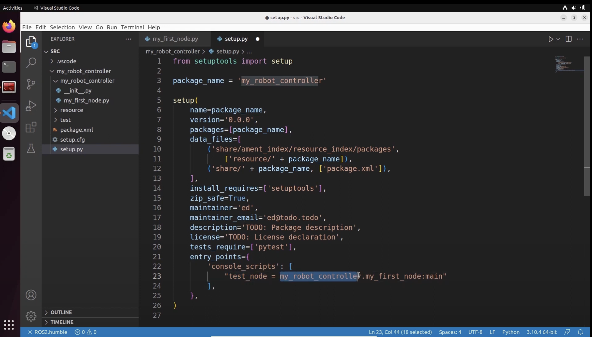

# ROS

## Comandos importantes

- rqt_graph
    
    Mostra os nodos que estão ligados em uma interface gráfica
    
- ros2 run nameOfPackage nameOfTheNode
    
    Inicia um nodo do ROS
    
- ros2 topic list
- ros2 topic info /nomeDoTopico
- ros2 interface show rosTopicType (consegue a partir do topic info)
- ros2 topic echo /nomeDoTopico

## Como criar um workspace

```bash
# Instalar Colcon
sudo apt update
sudo apt install python3-colcon-common-extensions

# Colocar a seguinte linha no .bashrc
source /usr/share/concon_argcomplete/hook/colcon-argcomplete.bash

# Criar pasta do workspace
mkdir ros2_ws
cd ros2_ws
mkdir src

# Rodar a build que cria as pastas necessárias dentro de seu workspace
colcon build

# Colocar seguinte arquivo bash no .bashrc
source ~/ros2_ws/install/setup.bash
```

## Como criar uma package

```bash
# Entrar na pasta do seu workspace
cd ros2_ws
cd src

# Comando para criar a package
ros2 pkg create my_robot_controller --build-type ament_python --dependencies rclpy

# Fazer build da package (voltar para folder do workspace)
cd ..
colcon build
```

## Como criar um node

```bash
# Entrar na pasta de dentro da package
cd ros2_ws/my_robot_controller/my_robot_controller

# Criar o arquivo py do node
touch my_first_node.py

# Transformar o arquivo em um executável
chmod +x my_first_node.py
```

Código de dentro do my_first_node:

```python
#!/usr/bin/env python3
import rclpy
from rclpy.node import Node

# Instalar extensão do ROS para ter autocomplete de ROS no vscode

# Node Class
class MyNode(Node):
	def __init__(self):
		super().__init__("first_node")
		
		# Log no terminal
		self.get_logger().info("Hello from ROS2")

# Criar função main
def main(args=None):
	# Iniciar ROS
	rlcpy.init(args=args)

	# Criar node
	node = MyNode()
	
	# Manter node ligado
	rclpy.spin(node)

	# Desligar ROS
	rlcpy.shutdown()

if __name__ == '__main__':
	main()
```

Depois, colocar no arquivo [setup.py](http://setup.py) um novo console script, exemplo:



Rodar os comandos:

```bash
colcon build --symlink-install
source ~/.bashrc
ros2 run my_robot_controller test_node
```

Exemplo de código de um node:


## Exemplo de node publisher


## Exemplo de node subscriber


## Como instalar o vscode

```bash
sudo snap install code --classic
```

## Como instalar o pip3

```bash
sudo apt install python3-pip
```